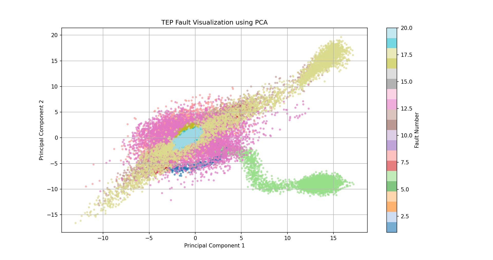
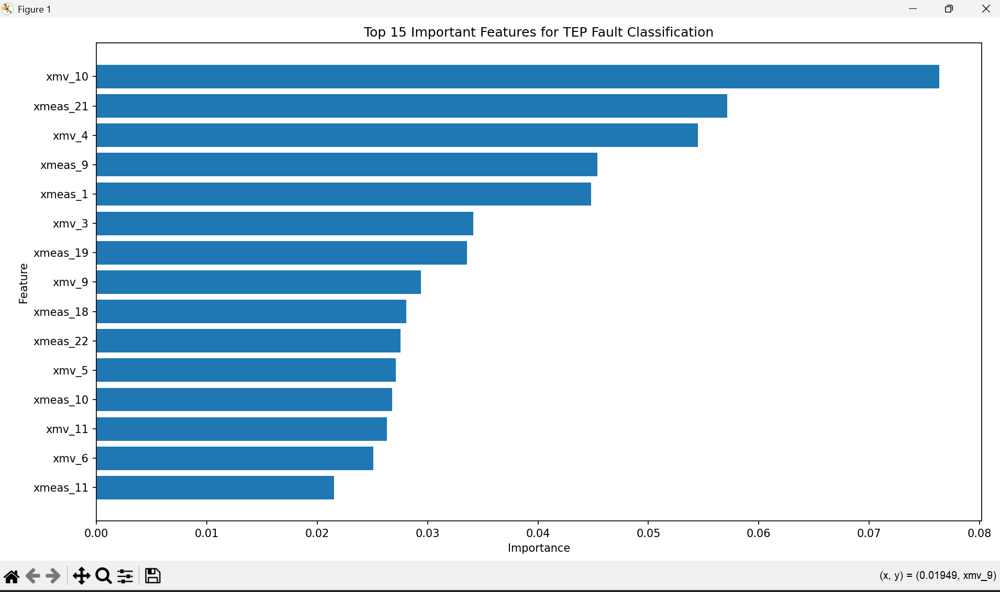

instantaneous process snapshots
YOUR PROJECT NOW HAS REAL MILESTONES
Milestone 1

Dataset validation & diagnostics

Milestone 2

PCA-based fault-space visualization

Milestone 3

20-class industrial fault classification

Milestone 4

Feature importance & interpretability

Milestone 5

Unsupervised anomaly detection
