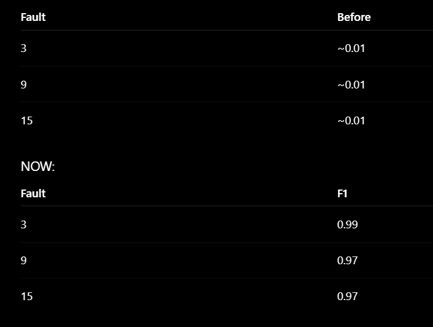
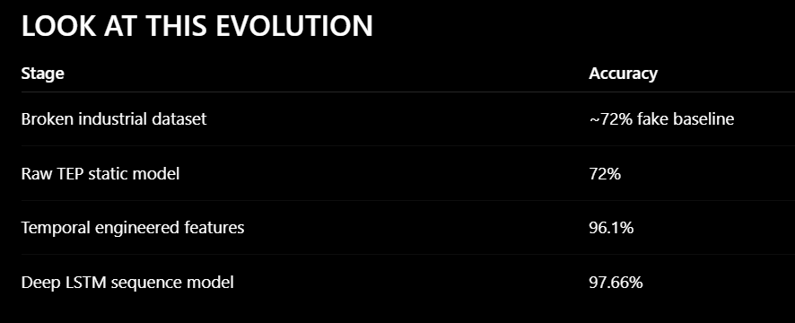

Temporal Information
it sees:

trends,
dynamics,
evolution,
drift,
process transitions.

Nearly ALL faults became separable.

Process evolution matters more than instantaneous values.
-------------------------
LSTM is not learning at all.
preprocessing mistake.
Your Random Forest worked WITHOUT scaling issues because:

tree models don’t care much about feature scaling.

BUT:

neural networks ABSOLUTELY do.

Right now your features have wildly different range
features have wildly different ranges:

Examples:

some variables near 0,
some near 4000,
some near 100.

The LSTM gradients get destroyed.

So the network collapses into:

predicting one class only

sequence normalization.

Developed a deep-learning-based industrial fault
diagnosis system using the Tennessee Eastman Process benchmark.

Implemented:
- multivariate process monitoring,
- anomaly detection,
- temporal feature engineering,
- LSTM sequence modeling,
- real-time monitoring dashboard.

Improved fault classification accuracy
from 72% (static ML) to 97.6% using
temporal process intelligence.